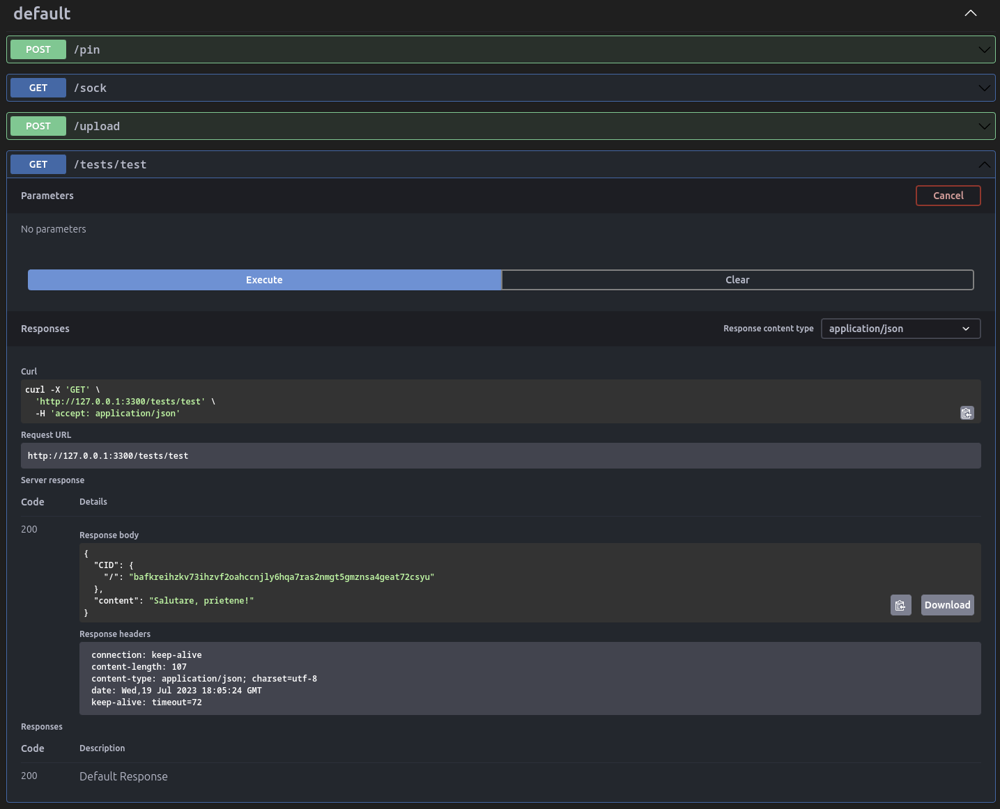

# k-entities

Aplicația are în țintă realizarea unui API cu ajutorul căruia să poți descompune orice resursă de informare, a cărui părți să le încarci într-un nod IPFS.

Construcția se face pe Fastify din motive legate de viteză și oportunități de modularizare.

## Instalare și pornire

Clonează repo-ul și apoi `npm install`.
Pornește-l cu `nodemon server.js`.
## Documentarea API-ului

Aplicația are instalat swagger și swagger-ui de la Fastify cu care se creează automat documentația API-ului.
După ce pornești serverul, consultă: http://127.0.0.1:3300/documentation/static/index.html. Rulează doar ruta de test, deocamdată. Vezi mai jos în imagine:

## Resurse pentru dezvoltare

[Building a modular monolith with Fastify - Matteo Collina, Node Congress 2023](https://www.youtube.com/watch?v=e1jkA-ee_aY)
